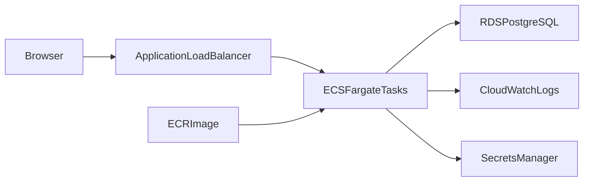

# AWS ECS Fargate Walkthrough

This guide explains what the deployment scripts create and how to inspect the running system.

## Architecture



## 1. Authenticate AWS CLI

Use IAM Identity Center or another AWS CLI profile before running deployment commands:

```sh
aws login
aws sts get-caller-identity
```

The identity needs permissions for ECR, CloudFormation, EC2, ECS, Elastic Load Balancing, RDS, IAM, Logs, and Secrets Manager.

## 2. Configure Deployment Values

Copy the example config:

```sh
cp scripts/aws/config.example.env scripts/aws/config.env
```

Set a real `DATABASE_PASSWORD` with at least 16 characters. Keep `scripts/aws/config.env` local because it contains deployment-specific values.

## 3. Deploy

Run the all-in-one script:

```sh
./scripts/aws/deploy-all.sh
```

The script creates or reuses ECR, builds and pushes the Docker image, then deploys the CloudFormation stack.

## 4. Inspect The Stack

After deployment, CloudFormation outputs the ALB URL:

```sh
aws cloudformation describe-stacks \
  --stack-name node-aws-api-dev \
  --region ap-southeast-1 \
  --query "Stacks[0].Outputs"
```

Test the API:

```sh
curl http://YOUR_ALB_DNS_NAME/health
curl http://YOUR_ALB_DNS_NAME/todos
```

## 5. Learn Each AWS Service

- VPC: network boundary that contains all resources.
- Public subnets: host the ALB and NAT Gateway.
- Private subnets: host Fargate tasks and RDS.
- ECR: stores the Docker image.
- ECS Fargate: runs containers without managing EC2 instances.
- ALB: accepts public HTTP traffic and health checks `/health`.
- RDS PostgreSQL: stores application data in private subnets.
- Secrets Manager: stores `DATABASE_URL` for ECS tasks.
- CloudWatch Logs: receives container stdout and stderr.

## 6. Debug Common Failures

- ECS task stops immediately: check CloudWatch Logs for app or migration errors.
- Target group unhealthy: verify `/health` returns `200` and the ECS security group accepts ALB traffic.
- Database connection fails: verify RDS is available and the RDS security group allows the ECS security group.
- Image pull fails: verify ECR image tag and ECS task execution role permissions.

## 7. Add HTTPS Later

The first stack uses HTTP for clarity. After it works:

1. Request an ACM certificate in the same region as the ALB.
2. Validate the certificate with DNS.
3. Add an ALB listener on port `443`.
4. Redirect port `80` to `443`.
5. Point Route 53 or your DNS provider to the ALB.

## 8. Clean Up Costs

This project creates paid resources, especially NAT Gateway, ALB, RDS, and Fargate.

Delete the stack when finished:

```sh
./scripts/aws/destroy-stack.sh
```

Then remove the ECR repository if you no longer need the images:

```sh
aws ecr delete-repository \
  --repository-name node-aws-api \
  --force \
  --region ap-southeast-1
```
